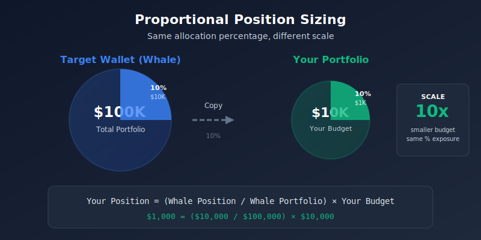
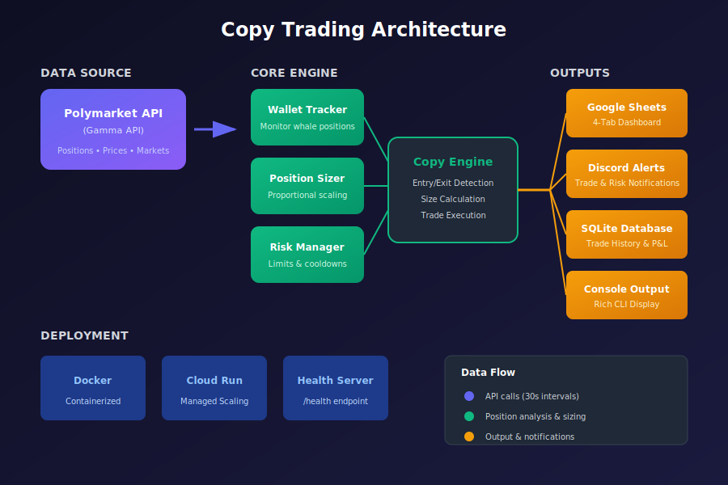

<div align="center">

# Polymarket Copy Trader

### Mirror the masters. Automate your edge.

[](https://python.org)
[](https://opensource.org/licenses/MIT)
[](Dockerfile)
[](#deployment)
[](https://github.com/tomdekel/polymarket-copy-trader/pulls)

**Automatically copy trades from successful Polymarket wallets with intelligent position sizing and risk management.**

[Quick Start](#quick-start) · [How It Works](#what-is-copy-trading) · [Dashboard](#google-sheets-dashboard) · [Configuration](#configuration) · [Deployment](#deployment)

</div>

---

## Quick Start

### Prerequisites

- Python 3.11+
- A wallet address to copy (find successful traders on [Polymarket leaderboards](https://polymarket.com))

### Installation

```bash
# Clone the repository
git clone https://github.com/tomdekel/polymarket-copy-trader.git
cd polymarket-copy-trader

# Create virtual environment
python -m venv venv
source venv/bin/activate  # On Windows: venv\Scripts\activate

# Install dependencies
pip install -r requirements.txt
```

### First Run (Safe Simulation Mode)

The bot defaults to **dry-run mode** — no real trades, just simulation:

```bash
# Watch a wallet (read-only monitoring)
python copy_trader.py watch 0x1234567890abcdef...

# Start copy trading in simulation mode
python copy_trader.py copy \
  --wallet 0x1234567890abcdef... \
  --budget 10000 \
  --dry-run
```

**Expected output:**
```
Polymarket Copy Trader
Target Wallet: 0x1234...cdef
Your Budget: $10,000.00
Mode: DRY RUN (simulation)

[DRY RUN] BUY: bitcoin-100k-dec | Target: 12.5% | Our size: $1,250.00
[DRY RUN] BUY: eth-price-jan   | Target: 8.3%  | Our size: $830.00
```

> **Safe to experiment!** Dry-run mode simulates trades without touching real funds. Use `--live` only when you're ready for real execution.

---

## Dashboard Preview

Track your copy trading performance in real-time with a 4-tab Google Sheets dashboard:

<div align="center">

</div>

- **Portfolio Summary** — Budget, P&L, session duration, trade statistics
- **Target Positions** — What the whale is holding right now
- **Our Trades** — Your mirrored positions with real-time P&L
- **Comparison** — Side-by-side analysis: are you tracking the whale?

---

## What is Copy Trading?

Copy trading lets you automatically mirror the positions of successful traders. When the target wallet buys, you buy. When they sell, you sell.

**The key insight: proportional sizing.**

<div align="center">

</div>

If a whale with $100K puts 10% into a position ($10K), and you have $10K, you'd put 10% in too ($1K). Same percentage exposure, different absolute scale.

**This bot automates that math for every position, every time.**

---

## Key Features

### Real-Time Wallet Tracking
Monitor any Polymarket wallet via the Gamma API. The bot polls every 30 seconds (configurable) to detect position changes.

### Proportional Position Sizing
Automatically calculate position sizes that match the target wallet's allocation percentages:

```
Your Position = (Target Position ÷ Target Portfolio) × Your Budget
```

| Whale Portfolio | Whale Position | Your Budget | Your Position |
|-----------------|----------------|-------------|---------------|
| $100,000        | $10,000 (10%)  | $10,000     | $1,000 (10%)  |
| $100,000        | $15,000 (15%)  | $5,000      | $750 (15%)    |
| $50,000         | $2,500 (5%)    | $20,000     | $1,000 (5%)   |

### Risk Management

Built-in protections to limit downside:

| Protection | Default | Description |
|------------|---------|-------------|
| Daily Loss Limit | 10% | Stop trading if daily losses exceed threshold |
| Total Loss Limit | 25% | Emergency halt at total drawdown |
| Cooldown Period | 5 min | Pause after significant losses |
| Min Liquidity | $1,000 | Skip illiquid markets |
| Max Slippage | 5% | Reject trades with excessive slippage |

### Google Sheets Dashboard

Real-time dashboard that syncs every 3 minutes with:
- Portfolio summary and P&L breakdown
- Target wallet positions vs your positions
- Trade statistics (win rate, avg win/loss)
- Strategy viability analysis

### Discord Notifications

Get instant alerts for:
- Trade executions (buy/sell)
- Risk limit triggers
- Session start/stop

<div align="center">

</div>

### Cloud-Native Deployment

Deploy to Google Cloud Run with health checks, graceful shutdown, and environment-based configuration.

---

## Architecture

<div align="center">

</div>

**Data Flow:**
1. **Wallet Tracker** polls Polymarket API for target wallet positions
2. **Position Sizer** calculates proportional position sizes for your budget
3. **Risk Manager** validates trades against loss limits and filters
4. **Copy Engine** coordinates execution and records trades
5. **Outputs** sync to Google Sheets, Discord, database, and console

---

## Accounting Model (Shares vs Size)

- `size` (or `cost_basis`) is **USD invested at entry**, not share quantity.
- `shares` is computed as `size / entry_price` and is the quantity used in P&L math.
- **Open/unrealized P&L**: `(current_price - entry_price) * shares`
- **Closed/realized P&L**: `proceeds - cost_basis`, where `proceeds = shares * exit_price`
- **Portfolio current value** always reconciles as: `cash + sum(open_position_current_value)`
- Exported reports include explicit `realized_pnl`, `unrealized_pnl`, and unified `pnl` (status-aware).

Use `python3 scripts/recompute_trade_metrics.py --db trades.db` to backfill accounting columns on historical rows.

### Accounting invariants (must always hold)

- Open trade:
  - `abs(cost_basis_usd - shares * entry_price) < eps`
  - `abs(current_value_usd - shares * current_price) < eps`
- Closed trade:
  - `abs(proceeds_usd - shares * exit_price) < eps`
  - `abs(realized_pnl_usd - (proceeds_usd - cost_basis_usd)) < eps`
- Portfolio:
  - `abs(portfolio_current_value - (cash + sum(open_position_values))) < eps`
- Field semantics:
  - Open rows have `current_price` and **no** `exit_price`
  - Closed rows have `exit_price` and **no** `current_price`
  - `entry_price`, `current_price`, `exit_price` are probabilities in `[0, 1]`

The bot runs a last-mile reconciliation gate each cycle and fails fast on violations (halts in live mode).

---

## Slippage Diagnostics Pipeline

Execution diagnostics are stored in SQLite table `execution_records` and exported to `slippage.csv` for analysis.

```bash
# Smoke test the pipeline end-to-end (insert + export check)
python3 scripts/smoke_execution_diagnostics.py --db trades.db --output slippage_smoke.csv

# Export one row per filled order
python3 scripts/export_slippage.py --db trades.db --output slippage.csv

# Troubleshoot empty exports
python3 scripts/export_slippage.py --db trades.db --output slippage.csv --debug

# Analyze distributions, p50/p90/p95, and market rankings
python3 scripts/analyze_slippage.py --input slippage.csv

# Run controlled measurement run + export + analysis
python3 scripts/run_slippage_experiment.py --db trades.db --n 30 --max-size-usd 5 --run-tag MIXED_MARKET

# Run the three required cohorts and summarize
python3 scripts/run_slippage_cohorts.py --db trades.db --n 30 --max-size-usd 5
```

See `docs/slippage_diagnostics.md` for metric definitions and baseline interpretation.

---

## Configuration

### Config File (`config.yaml`)

```yaml
# Target wallet to copy (can also use CLI --wallet)
target_wallet: "0x..."

# Your trading budget
starting_budget: 10000

# Execution settings
execution:
  check_interval: 30      # Seconds between API polls
  dry_run: true          # Simulation mode (no real trades)
  auto_execute: false    # Auto-execute trades without confirmation

# Position sizing
position_sizing:
  strategy: proportional
  max_position_pct: 0.15  # Max 15% of budget per position
  min_position_pct: 0.01  # Min 1% (skip smaller positions)
  leverage_cap: 1.0       # No leverage

# Risk management
risk_management:
  max_daily_loss_pct: 0.10   # Halt at 10% daily loss
  max_total_loss_pct: 0.25   # Halt at 25% total loss
  cooldown_after_loss: 300   # 5 min cooldown after loss
  skip_high_risk_markets: true

# Market filters
filters:
  min_liquidity: 1000      # Skip markets with < $1K liquidity
  max_slippage: 0.05       # Skip if slippage > 5%
  excluded_markets: []     # Market IDs to never trade
  max_time_to_resolution: 2592000  # 30 days

# Notifications
reporting:
  console_output: true
  log_level: INFO
  webhook_url: ""  # Discord webhook URL

# Google Sheets sync
sheets:
  enabled: false
  sheet_id: ""           # From Google Sheets URL
  credentials_path: ""   # Path to service account JSON
```

### Environment Variables

All settings can be overridden with environment variables (prefix: `COPY_TRADER_`):

| Variable | Config Path | Example |
|----------|-------------|---------|
| `COPY_TRADER_TARGET_WALLET` | `target_wallet` | `0x1234...` |
| `COPY_TRADER_BUDGET` | `starting_budget` | `10000` |
| `COPY_TRADER_DRY_RUN` | `execution.dry_run` | `true` |
| `COPY_TRADER_WEBHOOK_URL` | `reporting.webhook_url` | `https://discord...` |
| `COPY_TRADER_SHEETS_ENABLED` | `sheets.enabled` | `true` |
| `COPY_TRADER_SHEETS_ID` | `sheets.sheet_id` | `abc123...` |
| `COPY_TRADER_MAX_DAILY_LOSS_PCT` | `risk_management.max_daily_loss_pct` | `0.10` |

### Trader Profiles

Adjust risk tolerance by modifying position sizing and risk limits:

**Conservative** — Capital preservation
- Max Position: 10% · Daily Limit: 5% · Total Limit: 15%

**Moderate** (default) — Balanced approach
- Max Position: 15% · Daily Limit: 10% · Total Limit: 25%

**Aggressive** — Higher risk tolerance
- Max Position: 25% · Daily Limit: 15% · Total Limit: 35%

---

## Google Sheets Dashboard

### Setup

1. **Create a Google Cloud service account:**
   ```bash
   # Create service account
   gcloud iam service-accounts create copy-trader-sheets \
     --display-name="Copy Trader Sheets"

   # Download credentials
   gcloud iam service-accounts keys create credentials.json \
     --iam-account=copy-trader-sheets@YOUR_PROJECT.iam.gserviceaccount.com
   ```

2. **Create a new Google Sheet** and share it with the service account email (found in credentials.json)

3. **Configure the bot:**
   ```yaml
   sheets:
     enabled: true
     sheet_id: "your-sheet-id-from-url"
     credentials_path: "credentials.json"
   ```

### Dashboard Tabs

| Tab | Purpose | Key Columns |
|-----|---------|-------------|
| **Portfolio Summary** | Overall status | Budget, P&L, Win Rate, Trade Stats |
| **Target Positions** | Whale's current holdings | Market, Side, Shares, Entry Price, P&L |
| **Our Trades** | Your mirrored positions | Market, Side, Cost Basis, Current Value, P&L |
| **Comparison** | Strategy analysis | Coverage %, Entry Slippage, Performance vs Whale |

---

## Discord Notifications

### Setup

1. Create a Discord webhook in your server settings
2. Add the URL to config:
   ```yaml
   reporting:
     webhook_url: "https://discord.com/api/webhooks/..."
   ```

### Alert Types

| Alert | Trigger | Color |
|-------|---------|-------|
| Trade | Position opened/closed | Green |
| Risk | Loss limit triggered | Orange |
| Startup | Bot started | Blue |
| Shutdown | Bot stopped | Blue |
| Error | API/system errors | Red |

---

## Deployment

### Docker

```bash
# Build the image
docker build -t polymarket-copy-trader .

# Run in dry-run mode
docker run \
  -e COPY_TRADER_TARGET_WALLET=0x... \
  -e COPY_TRADER_BUDGET=10000 \
  -e COPY_TRADER_DRY_RUN=true \
  polymarket-copy-trader
```

### Google Cloud Run

```bash
# Deploy to Cloud Run
gcloud run deploy copy-trader \
  --source . \
  --region us-central1 \
  --set-env-vars "COPY_TRADER_TARGET_WALLET=0x...,COPY_TRADER_BUDGET=10000" \
  --allow-unauthenticated

# The health endpoint at /health is used for Cloud Run health checks
```

### Environment-Based Execution

For containerized deployments, use the `run` command which reads from environment variables:

```bash
python copy_trader.py run --health-port 8080
```

Required environment variables:
- `COPY_TRADER_TARGET_WALLET`
- `COPY_TRADER_BUDGET`

---

## CLI Commands

| Command | Description |
|---------|-------------|
| `copy --wallet ADDR --budget N` | Start copy trading |
| `watch ADDR` | Monitor wallet without copying |
| `status` | Show current positions |
| `run` | Run using environment variables |

### Options

```bash
python copy_trader.py copy --help

Options:
  -w, --wallet TEXT       Target wallet address to copy [required]
  -b, --budget FLOAT      Your trading budget in USD [required]
  --dry-run / --live      Run in simulation mode (default) or live
  --health-port INTEGER   Port for health check server [default: 8080]
  -c, --config PATH       Path to config file
  -h, --help              Show this message and exit
```

---

## API Rate Limits

The bot respects Polymarket API rate limits:

| Setting | Default | Description |
|---------|---------|-------------|
| `check_interval` | 30s | Time between position polls |
| `api.max_retries` | 3 | Retry attempts on failure |
| `api.min_wait` | 1s | Min wait between retries |
| `api.max_wait` | 30s | Max wait between retries |
| `api.timeout` | 30s | Request timeout |

---

## Project Structure

```
polymarket-copy-trader/
├── copy_trader.py      # CLI entry point
├── wallet_tracker.py   # Polymarket API integration
├── position_sizer.py   # Proportional sizing logic
├── risk_manager.py     # Loss limits and filters
├── database.py         # SQLite trade storage
├── sheets_sync.py      # Google Sheets dashboard
├── notifications.py    # Discord webhooks
├── health_server.py    # Cloud Run health checks
├── config_loader.py    # Configuration management
├── utils.py            # Helpers and formatting
├── config.yaml         # Default configuration
├── requirements.txt    # Python dependencies
├── Dockerfile          # Container build
└── docs/assets/        # Documentation images
```

---

## Contributing

Contributions are welcome! Please read the contributing guidelines before submitting a PR.

1. Fork the repository
2. Create a feature branch (`git checkout -b feature/amazing-feature`)
3. Commit your changes (`git commit -m 'Add amazing feature'`)
4. Push to the branch (`git push origin feature/amazing-feature`)
5. Open a Pull Request

---

## Disclaimer

**This software is for educational and research purposes only.**

- Trading prediction markets involves significant financial risk
- Past performance of copied wallets does not guarantee future results
- Always use dry-run mode to test before live trading
- Never invest more than you can afford to lose
- The authors are not responsible for any financial losses

**Use at your own risk.**

---

## License

This project is licensed under the MIT License.

---

<div align="center">

**Built for traders who know that edge comes from execution, not just ideas.**

[Report Bug](https://github.com/tomdekel/polymarket-copy-trader/issues) · [Request Feature](https://github.com/tomdekel/polymarket-copy-trader/issues)

</div>
